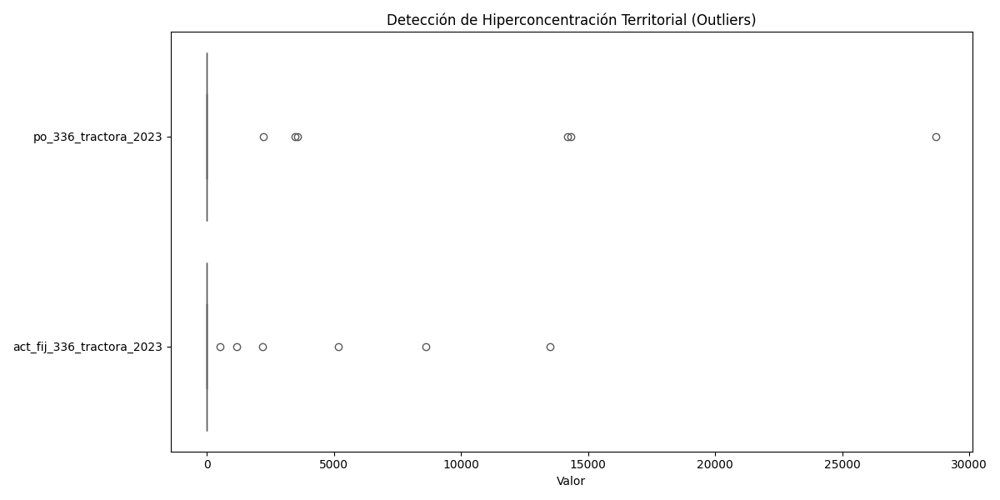
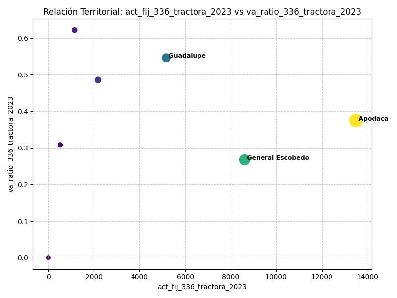
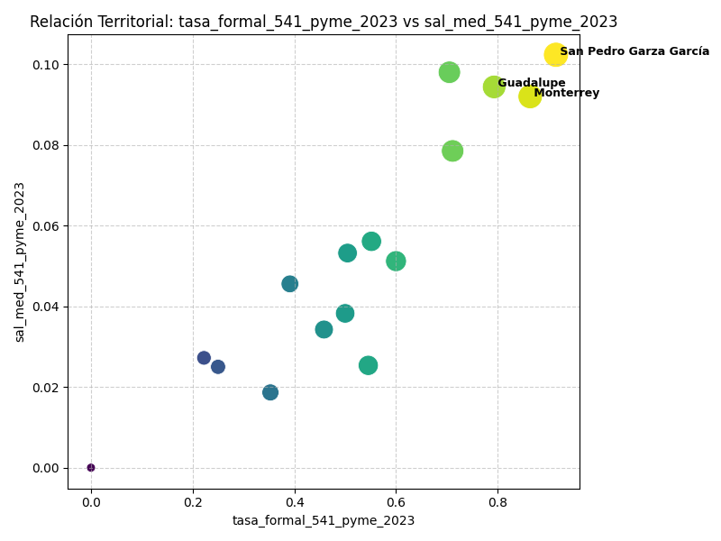
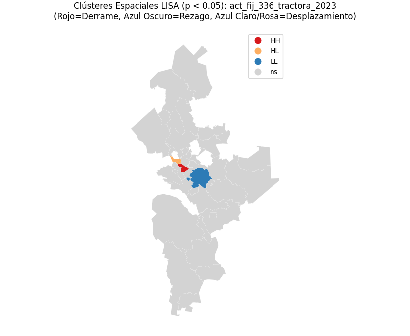
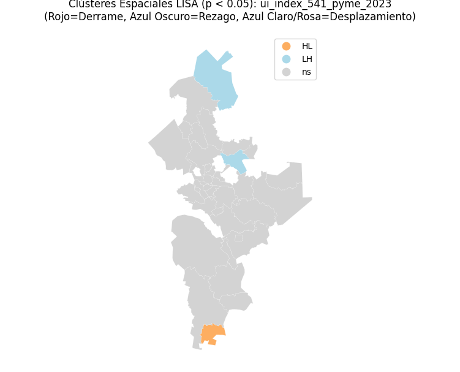

# Nearshoring y el Modelo de Enclave en Nuevo León: Un Análisis de Cadenas Globales de Valor mediante Econometría Espacial

En este trabajo, el reto que me he propuesto consistió en: 
1. **Automatizar la extracción, limpieza y acomodo** de bases de datos heterogéneas.
2. **Afinar mi capacidad de pensamiento crítico e interpretación de resultados**, extrayendo conclusiones relevantes a partir de los hallazgos obtenidos. 

En tanto es el primer proyecto que desarrollo fuera del marco académico, me permitiré redactar en primera persona, construyendo una guía de registro y aprendizaje antes que un *paper*, sin perder la rigurosidad técnica y científica.

## 1. Introducción y Planteamiento del Problema

Durante años, los economistas hemos sido instruidos en modelos que premian la liberalización y la apertura comercial. Remontémonos a la década de los 80´s. El escenario se compone de inflación desbordante, un estancamiento no previsto del paradigma tecnológico, y tensiones geopolíticas por el control de la hegemonía y los recursos. El estado no sabe invertir, y el (ag)ente que mejor comprende los mercados, las demandas y los precios, es la empresa.

Partiendo de este punto, la teoría ortodoxa afirma que las empresas multinacionales serán las encargadas de impulsar el crecimiento de las regiones históricamente rezagadas. Al transmutar la figura del estado interventor a facilitador, las grandes firmas extranjeras invertirán sus capitales en países en vías de desarrollo, generando efectos de derrama económica (*Spillover*). **Pero ¿Es esto así?**

Si desdibujar nuestras fronteras para captar inversión genera desarrollo, deberíamos ser capaces de medir dicho efecto en el tejido empresarial de la región. Para poner a prueba la teoría del spillover, me di a la tarea de cuantificar el impacto del asentamiento de grandes empresas en la red de proveeduría local de Nuevo León. La elección del estado se sustenta en que este ha sido el foco principal de recepción de Inversión Extranjera Directa industrial y logística de los últimos años. 

Una ráfaga de preguntas me abordó mientras analizaba la premisa: *¿Podría ser que, lejos de alimentarse de las PyMEs circunvecinas, la gran firma se surta a base de importaciones ignorando al ecosistema local, y alterando a su vez el mercado de trabajo? ¿Es acaso el nearshoring una ilusión contable de reinversión de utilidades, y no una expansión regional?* Si este fuera el caso, nos enfrentamos a un problema grave: significaría que la liberalización ya desplazó a la industria nacional y, además, no se está generando derrama económica.

> **Objetivo del Proyecto:** Automatizando la limpieza de censos de INEGI, demostraré mediante Modelos Espaciales (OLS/SAR/SEM) si los miles de millones invertidos en fábricas generan spillovers automáticos en las PyMEs locales, o si confirman la teoría del Modelo de Enclave.

---

## 2. Extracción, Limpieza y Transformación (ETL)

Quizá lo más laborioso del análisis de datos sea, precisamente, su limpieza. Excel es el estándar de registros y análisis para muchas empresas. Sin embargo, al trabajar con bases compuestas por millones de filas y múltiples niveles geográficos (DENUE, Censos Económicos y Shapefiles), hacer cruces en Excel supondría una tortura para la memoria RAM y tomaría horas de trabajo manual propenso a errores. Para fortuna mía, la programación orientada a objetos en **Python** reduce esta labor a tan solo minutos.

Para hacer econometría e inferencia estadística, es innegociable contar con una base ancha limpia y consistente. INEGI arroja descargas con totales y metadatos que solo comienzan en la cuarta fila. Python me permite saltar directamente a la información útil mediante `skiprows=4`. Si existen municipios que no registran una determinada industria, lo soluciono de manera efectiva imputando con `fill_value=0`.

Fue fundamental delimitar claramente quién era mi sector impulsor y quién era el tejido local haciendo uso del Sistema de Clasificación Industrial de América del Norte (SCIAN). Esquemáticamente, la diferenciación se expresa de la siguiente manera:

```text
   ┌──────────────────────────────────────────────────────────────────────────┐
   │                  CLASIFICACIÓN ECONOMÉTRICA A 3 DÍGITOS                  │
   └──────────────────────┬─────────────────────────────────────────┬─────────┘
                          │                                         │
 ┌────────────────────────┴────────┐ ┌──────────────────────────────┴─────────┐
 │ 1. TRACTORES NEARSHORING (31-33)│ │ 3. TEJIDO LOCAL PYMES (Servicios)      │
 ├─────────────────────────────────┤ ├────────────────────────────────────────┤
 │ • 336 Equip. Transporte         │ │ • 541 Serv. Profesionales y Científicos│
 │ • 334 Comput. y Electrónica     │ │ • 811 Reparación y Mantenimiento       │
 │ • 335 Equip. Eléctrico          │ │                                        │
 └─────────────────────────────────┘ └────────────────────────────────────────┘
```

---

## 3. Ingeniería de Características (Feature Engineering)

Llegado aquí, me enfrentaría con un proceso de selección igual de importante: las variables censales. Con un acervo selecto de variables, fui capaz de codificar el cálculo de índices convencionales:
* **Productividad Laboral:** `(A131A / H001A)`
* **Salario Medio:** `(J000A / H001A)`
* **Intensidad de Capital:** `(Q000A / H001A)`

Es aquí donde comienzo a aportar ideas a partir de la literatura. A partir del pensamiento de **Dussel Peters**, determiné que la sola producción bruta de las grandes empresas no nos sirve para medir el éxito económico. Por ello, calculé un índice que logra capturar la calidad de integración:
* **VA_Ratio:** `Valor Agregado Censal Bruto / Producción Bruta Total`. Si es bajo, significa que, aunque producen mucho, agregan poco valor local (insumos importados).

De igual forma, basado en **Lascurain y Fernández**, incorporé un *proxy* matemático para medir la **Capacidad de Absorción** de las PyMEs locales (Activos Fijos / Personal Ocupado), para responder a la pregunta: *¿Qué tan preparadas están las PyMEs para absorber el derrame económico?*

---

## 4. Análisis Exploratorio de Datos (EDA)

Antes de manipular, debo saber exactamente a qué me estoy enfrentando. El EDA resulta más amigo cuando, mediante herramientas de código, podemos pedirle a Python un escaneo integral.



Al fijarme en la columna de la mediana de las estadísticas descriptivas, noté que el resultado es exactamente cero para casi todas las variables. En un sentido práctico, **en al menos la mitad de los municipios de Nuevo León, la industria automotriz tractora no existe**. Las barreras de entrada son tan altas que la Inversión Extranjera Directa (IED) crea monopolios territoriales.

Llama la atención la media (`0.067`) del *VA_Ratio* de las tractoras. En promedio, por cada 100 pesos que generan estas gigantes automotrices, **solo agregan 6.7 pesos de valor local**. El resto son insumos importados. Dussel tiene razón: el nearshoring se está comportando como una **Maquila 2.0**.



Esta gráfica materializa la "Paradoja del Enclave". **Apodaca** jala la escala de inversión hasta casi $13,497 millones de pesos, pero opera como un sistema cerrado con bajísimo valor agregado. Por el contrario, **Guadalupe** representa el *Upgrading* (ascenso industrial); su madurez industrial histórica le permite anclar el desarrollo en el territorio, reteniendo mucho más valor.



Cuando analizamos al talento local (PyMEs), la desconexión territorial es notable. Las fábricas gigantes se instalan en la periferia (Apodaca, Escobedo), pero las PyMEs formales y de altos salarios están atrincheradas en **San Pedro, Monterrey y Guadalupe**. Montaño Hirose nos advierte de esto: las multinacionales exigen "flexibilidad laboral", lo que se traduce en precarización para las PyMEs periféricas que intentan sobrevivir compitiendo por precios.

---

## 5. Análisis Exploratorio de Datos Espaciales (ESDA)

Para medir si existía una correlación geográfica, calculé el Índice de Moran y los Mapas LISA (*Local Indicators of Spatial Association*).



**El Choque Exógeno (Tractoras):** El Índice de Moran Global es fuertemente positivo ($p=0.02$). El mapa nos muestra un **Clúster Rojo (High-High)** en Apodaca y Escobedo. Esto confirma que el Nearshoring responde estrictamente a *economías de aglomeración*. Las multinacionales no buscan dispersarse, compiten por estar pegadas compartiendo infraestructura. Sus vecinos inmediatos conforman un Anillo Azul Claro (Low-High), confirmando un **Efecto Sombra o Desplazamiento territorial**.



**El Ascenso Industrial (PyMEs):** El mapa de las PyMEs es un océano gris. El Índice de Moran arrojó un patrón aleatorio ($p=0.364$). Esto **sepulta el mito del spillover geográfico automático**. Estar físicamente al lado de un gigante industrial no garantiza un efecto contagio. El *upgrading* depende de las capacidades internas de cada empresa, no de su código postal.

---

## 6. Modelado Econométrico Espacial (OLS vs SAR vs SEM)

Para cuantificar causalidades, estimé un modelo espacial multivariado tomando como variable dependiente el Índice de Ascenso Industrial (Upgrading) de las PyMEs de servicios profesionales. 

Lo primero que hace un econometrista es revisar los Multiplicadores de Lagrange (LM Tests) de la regresión OLS base para saber si se debe migrar a un modelo de Rezago Espacial (SAR) o de Error Espacial (SEM):

* **Diagnóstico LM de Dependencia Espacial:**
  * `Lagrange Multiplier (lag)`: $p = 0.3841$
  * `Lagrange Multiplier (error)`: $p = 0.3575$
  
Dado que ningún test espacial resultó estadísticamente significativo, **el modelo OLS resultó ser el más eficiente y parsimonioso**, logrando explicar el **77.55% de la varianza** ($R^2 = 0.7755, F = 29.37, p < 0.001$). El hecho de que lo espacial no sea significativo es un triunfo teórico: confirma que el ascenso de las PyMEs obedece a factores endógenos y no a contagio vecinal.

**Análisis Causal (Resultados OLS):**

1. **La Estocada Final al Nearshoring (`act_fij_336_tractora`):** El coeficiente de la inversión extranjera arrojó un **$p = 0.729$ (No Significativo)**. Los miles de millones de pesos en las megafábricas tienen **efecto cero** sobre el ascenso industrial de las PyMEs locales, probando matemáticamente la existencia de un **Modelo de Enclave**.
2. **El Talento como Motor (`sal_med_541_pyme`):** Altamente significativo ($p = 0.003$). Por cada unidad que incrementa el salario medio, el upgrading aumenta en 55.59 puntos. El valor agregado se retiene contratando talento especializado, no esperando derrames pasivos.
3. **La Trampa de la Precariedad (`tasa_formal_541_pyme`):** Coeficiente negativo y altamente significativo ($p < 0.001$). Demuestra que en la periferia, la formalización sin salarios competitivos funciona como un costo administrativo que asfixia a la PyME, en lugar de generar modernización tecnológica real.

---

## 7. Conclusión y Hallazgos

El presente proyecto demuestra empíricamente, mediante ciencia de datos y econometría espacial, que **el Nearshoring en Nuevo León opera bajo un Modelo de Enclave**. 

La liberalización comercial y la simple atracción de Inversión Extranjera Directa no generan derrames tecnológicos (spillovers) de forma automática. Las grandes plantas se aglomeran para minimizar costos, pero operan desconectadas del tejido local. El éxito y modernización de las PyMEs recae enteramente en su propia capacidad de absorción y retención de capital humano avanzado. 

*Desdibujar fronteras no es sinónimo de desarrollo si no se construye, desde adentro, la capacidad técnica para asimilarlo.*
